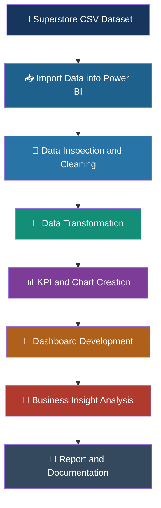

<div align="center">


<br/>


</div>

---

# 📊 Project Overview

**Data Visualization and Storytelling** is a business intelligence project focused on transforming raw Superstore sales data into meaningful business insights through interactive dashboards and visual analytics.

Using **Microsoft Power BI**, this project explores sales performance, profit distribution, product categories, customer segments, geographical patterns, and time-based trends.

The dashboard combines KPI cards, charts, and geographic visualizations to make complex business information easier to understand.

### 💡 Project Vision

> "Data becomes powerful when it is transformed into information that people can understand and use."

The main purpose is not just to create charts, but to communicate what the data reveals about business performance.

---

# 🎯 Project Objectives

- 📌 **Analyze Business Performance:** Explore sales, profit, orders, and quantity metrics.
- 📊 **Build Interactive Dashboards:** Develop clear and organized visual reports using Power BI.
- 📈 **Discover Sales Trends:** Examine sales changes over time.
- 🛒 **Evaluate Product Categories:** Compare sales performance across different product groups.
- 🌎 **Analyze Regional Performance:** Explore profit and sales across geographical regions.
- 👥 **Understand Customer Segments:** Compare customer groups by their contribution to sales.
- 💡 **Communicate Business Insights:** Present findings through data storytelling.
- 🧠 **Develop Analytics Skills:** Gain practical experience in data cleaning, visualization, and interpretation.

---

# 🛠️ Technology Stack

<div align="center">

| Technology | Role | Application |
|---|---|---|
| 🟡 Microsoft Power BI | Business Intelligence | Dashboard creation and visual analytics |
| 📁 CSV | Data Source | Superstore transaction data |
| ⚙️ Power Query | Data Preparation | Data inspection and transformation |
| 📊 Data Visualization | Analytical Method | Charts, graphs, maps, and KPI cards |
| 📝 Microsoft Word | Documentation | Project report preparation |
| 🐙 GitHub | Version Control | Project hosting and documentation |

</div>

---

# 📂 Dataset Description

The project uses a Superstore sales dataset containing transaction-related information about products, customers, orders, and geographical locations.

### 📋 Important Dataset Fields

| Field | Description | Analytical Purpose |
|---|---|---|
| Order Date | Date an order was placed | Time-series analysis |
| Sales | Sales amount | Revenue analysis |
| Profit | Profit generated | Profitability analysis |
| Quantity | Number of units sold | Sales volume analysis |
| Category | Product category | Category comparison |
| Region | Geographical region | Regional performance |
| State | State associated with an order | Geographic analysis |
| Segment | Customer segment | Customer analysis |
| Order ID | Unique order identifier | Order counting |
| Product Name | Name of the product | Product-level exploration |

### 🔍 Dataset Preparation

The dataset was imported into Power BI and inspected using Power Query Editor.

Preparation activities included:

- Importing the CSV dataset.
- Inspecting field names and data types.
- Converting the Order Date column to a date format using locale settings.
- Identifying the fields needed for analysis.
- Applying changes and loading the prepared data into Power BI.

---

# ⚙️ Project Workflow

<div align="center">



</div>

### 🧩 Workflow Explanation

**1. Data Collection**

Obtain the Superstore dataset in CSV format.

**2. Data Import**

Load the dataset into Microsoft Power BI Desktop.

**3. Data Cleaning**

Inspect the data and correct the date data type using Power Query Editor.

**4. Data Transformation**

Prepare the fields required for KPI calculations and visual analysis.

**5. Visualization**

Create KPI cards, column charts, line charts, bar charts, donut charts, and map visuals.

**6. Dashboard Development**

Arrange the visualizations into a single dashboard with a descriptive title.

**7. Business Analysis**

Review the charts to identify patterns in sales, profit, customer segments, and geographical performance.

**8. Reporting**

Document the methodology, visuals, observations, and conclusions.

---

# 📈 Dashboard Features

The dashboard includes several visual components designed to provide different perspectives on the dataset.

## 💰 1. Key Performance Indicators

KPI cards summarize important business metrics.

| KPI | Displayed Value | Purpose |
|---|---:|---|
| 💵 Total Sales | 2.30M | Summarizes overall sales |
| 📦 Total Orders | 5K | Shows the order count |
| 💹 Total Profit | 286.40K | Summarizes overall profit |
| 🛒 Total Quantity | 38K | Shows the total units sold |

*Values are based on the dashboard screenshot shared during development. Verify the final figures before submission.*

## 📊 2. Sales by Category

**Chart Type:** Clustered Column Chart

Compares sales among the following categories:

- 🪑 Furniture
- 📎 Office Supplies
- 💻 Technology

**Analytical Purpose:**
- Compare category-level sales.
- Identify categories with higher or lower sales.
- Explore how product groups contribute to overall revenue.

## 📈 3. Monthly Sales Trend

**Chart Type:** Line Chart

Uses Order Date and Sales to visualize sales over time.

**Analytical Purpose:**
- Observe changes in sales across months.
- Identify visible peaks and declines.
- Explore possible seasonal patterns.
- Understand how sales performance changes over time.

## 🌎 4. Profit by Region

**Chart Type:** Clustered Bar Chart

Compares profit across four regions:

- Central
- East
- South
- West

**Analytical Purpose:**
- Compare regional profitability.
- Identify regions with relatively higher or lower profit.
- Investigate possible geographical differences in performance.

## 🍩 5. Sales by Customer Segment

**Chart Type:** Donut Chart

Explores sales distribution among:

- Consumer
- Corporate
- Home Office

**Analytical Purpose:**
- Compare customer segment contributions.
- Understand how sales are distributed across customer groups.
- Identify segments for further investigation.

## 🗺️ 6. Sales by State

**Chart Types:** Map and Bar Chart

Visualizes sales across different states.

**Analytical Purpose:**
- Explore geographical sales distribution.
- Compare state-level sales.
- Identify geographical differences in sales performance.

---

# 🔍 Business Insights

The dashboard can support several types of business observations.

| Analysis Area | Key Question | Insight to Record |
|---|---|---|
| Category Performance | Which category generates the most sales? | Technology is the expected top category in the standard dataset; verify your chart |
| Regional Profitability | Which region has the highest profit? | West is the expected top region in the standard dataset; verify your chart |
| Sales Trend | How do sales change over time? | Record the visible monthly peaks and declines |
| Customer Segments | Which segment contributes the most sales? | Record the largest segment from your donut chart |
| State-Level Sales | Which states have higher sales? | Record the states shown at the top of your chart |

### 🧠 Why Business Insights Matter

Visualizations help turn numerical information into observations that can be communicated to business users.

For example:

- Category comparisons can help identify product groups for further analysis.
- Regional comparisons can highlight differences in profitability.
- Time-based charts can reveal changes that may need investigation.
- Customer segment analysis can help describe the composition of sales.
- Geographic analysis can show where sales are concentrated.

These observations describe the data. Further investigation is needed before treating them as causes or making business decisions.

---

# 📸 Dashboard Screenshots

<div align="center">

### 🖥️ Main Dashboard


*Replace this image with your actual Power BI dashboard screenshot.*

### 📊 Individual Chart Details


**Sales by Category**


**Monthly Sales Trend**


**Profit by Region**

</div>

---

# 📁 Repository Structure

```text
Data-Visualization-and-Storytelling/
│
├── 📊 Superstore_Sales_Dashboard.pbix
│
├── 📂 dataset/
│   └── Sample-Superstore.csv
│
├── 📂 screenshots/
│   ├── dashboard.png
│   ├── sales-by-category.png
│   ├── monthly-sales-trend.png
│   └── profit-by-region.png
│
├── 📂 report/
│   ├── Superstore_Data_Visualization_Storytelling_Report.docx
│   └── Superstore_Data_Visualization_Storytelling_Report.pdf
│
└── 📄 README.md
```

*This is the suggested structure. Add only files that actually exist in your repository.*

---

# 🚀 How to Run the Project

### Prerequisites

- Microsoft Power BI Desktop
- Superstore CSV dataset
- Windows computer capable of running Power BI Desktop

### Installation and Usage

**Step 1: Clone the repository**

```bash
git clone https://github.com/Ganu0124/Data-Visualization-and-Storytelling.git
```

**Step 2: Navigate to the project directory**

```bash
cd Data-Visualization-and-Storytelling
```

**Step 3: Open the Power BI file**

Open:

```text
Superstore_Sales_Dashboard.pbix
```

using Microsoft Power BI Desktop.

**Step 4: Connect the dataset**

If Power BI requests a data source, select the Superstore CSV file and update the file path.

**Step 5: Explore the dashboard**

Review the KPI cards, charts, map, and other report visuals.

---

# 📊 Results and Observations

The completed dashboard provides a consolidated view of the Superstore dataset.

The initial dashboard displayed these approximate metrics:

- **Total Sales:** 2.30M
- **Total Orders:** 5K
- **Total Profit:** 286.40K
- **Total Quantity:** 38K

The visualizations provide additional ways to explore:

- Sales differences across product categories.
- Changes in sales over time.
- Profit comparisons among regions.
- Sales distribution across customer segments.
- Geographic sales differences across states.

The final results and any numerical comparisons should be taken directly from the saved Power BI report.

---

# ⚠️ Limitations

- The dashboard is based on the fields and records available in the selected dataset.
- The accuracy of findings depends on correct data types, aggregations, and geographic categorization.
- Charts show associations and patterns but do not independently establish the causes of business outcomes.
- The current report may require additional filters and drill-down features for deeper analysis.
- The dashboard's KPI values and final observations should be verified before submission.

---

# 🔮 Future Enhancements

Potential improvements include:

- 🎛️ **Interactive Slicers:** Add filters for date, category, region, and segment.
- 🔎 **Drill-Through Analysis:** Allow users to explore detailed records behind summary visuals.
- 📅 **Advanced Time Analysis:** Compare monthly, quarterly, and yearly sales.
- 📉 **Profit Margin Analysis:** Examine profitability relative to sales.
- 🧮 **Additional DAX Measures:** Create reusable measures for deeper analysis.
- 🎨 **Dashboard Design:** Improve spacing, typography, color consistency, and visual hierarchy.
- 📱 **Mobile Layout:** Create a layout suitable for Power BI mobile viewing.
- 📊 **More Detailed Reporting:** Add a separate report page for confirmed findings and supporting values.

---

# 📚 Learning Outcomes

Through this project, the following practical skills are developed:

- Importing and preparing structured datasets.
- Working with Power Query Editor.
- Understanding data types and field selection.
- Creating KPI cards and multiple chart types.
- Organizing a dashboard for readability.
- Exploring data patterns and business metrics.
- Writing data-driven observations.
- Documenting and publishing a project through GitHub.

---

# 👨‍💻 Author

<div align="center">


**Ganesh Ganu**

🎓 MCA – Artificial Intelligence & Data Science

💻 GitHub: [@Ganu0124](https://github.com/Ganu0124)

</div>

---

# ⭐ Support

If you find this project useful for learning Power BI, data analytics, or data storytelling, consider giving the repository a ⭐ star.

<div align="center">


### 📊 Turning Data into Stories.  
### 🚀 Exploring Insights Through Visualization.

</div>
